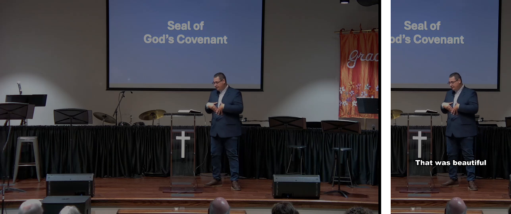

# Sermon Shorts

Turn a full church service recording into vertical, captioned social clips —
like CapCut's "long video to shorts," but built for church services.



*Left: the full service recording. Right: the same moment in the finished
clip — auto-cropped to the speaker, captions burned in.*

Give it the Sunday service MP4 and it will:

1. **Transcribe** the whole service locally with Whisper (word-level timestamps)
2. **Pick the best sermon moments** with Claude — complete, self-contained thoughts
   that work for someone who has never attended your church. It deliberately skips
   worship music (CCLI/music licensing generally does **not** cover social media),
   announcements, and offering segments.
3. **Reframe to 9:16** — finds the speaker's face and crops the vertical frame around them
4. **Burn in pop-style captions** from the transcript
5. **Render** 1080x1920 MP4s ready for Reels / Shorts / TikTok, with speech
   loudness-normalized to the −14 LUFS social standard
6. **Design a cover thumbnail** (`<clip>.jpg`) for each clip — a clean,
   caption-free frame centered on the speaker with the headline in bold —
   so the platform doesn't auto-pick an awkward mid-clip frame

Everything runs locally except the highlight-picking step, which sends the
*text transcript only* (never the video) to the Claude API.

## Requirements

- Python 3.10+ (Windows or macOS — no other installs needed; ffmpeg is bundled)
- An Anthropic API key: https://platform.claude.com/

## Setup

```
cd sermon-shorts
python -m venv .venv

# Windows
.venv\Scripts\activate
# Mac
source .venv/bin/activate

pip install -r requirements.txt
```

Set your API key — easiest is a `.env` file in the project folder:

```
# in sermon-shorts/, copy the template and edit it
copy .env.example .env    (Windows)
cp .env.example .env      (Mac)
```

Then put your key in `.env`:

```
ANTHROPIC_API_KEY=sk-ant-...
```

(Setting the `ANTHROPIC_API_KEY` environment variable also works and takes
precedence over the `.env` file.)

## Usage

```
python -m sermon_shorts "C:\videos\sunday-service.mp4" --clips 3
```

Output lands in `sunday-service_clips/` next to the video, along with a
`clips.json` manifest (titles, timestamps, and why each moment was chosen) and
a `.txt` file per clip with a ready-to-paste title + description, and a
`.jpg` cover thumbnail per clip to upload as the video's thumbnail.

### Trim a service down to just the sermon

```
python -m sermon_shorts "C:\videos\sunday-service.mp4" --sermon-only
```

Finds where the message starts and ends (skipping worship, announcements,
offering, and the closing) and saves `sunday-service_sermon.mp4` next to the
video — full resolution, no quality loss, done in seconds. The default cut
lands on the nearest keyframe (within a few seconds, absorbed by padding);
add `--reencode` if you need it frame-accurate.

Options:

| Flag | Default | Meaning |
|---|---|---|
| `--clips N` | 3 | how many clips to produce |
| `--out DIR` | `<video>_clips` | output directory |
| `--whisper-model` | `small` | `tiny`/`base`/`small`/`medium`/`large-v3` — bigger is more accurate, slower |
| `--language` | auto | e.g. `en`, `es` |
| `--no-captions` | off | skip burned-in captions |
| `--no-thumbnails` | off | skip the designed `.jpg` cover image per clip |
| `--sermon-only` | off | trim the service to just the sermon instead of making clips |
| `--reencode` | off | with `--sermon-only`: frame-accurate cut (slower) |
| `--from-manifest` | off | re-render the exact clips in `clips.json` (no new Claude call) |
| `--only N` | all | with `--from-manifest`: re-render only clip N |

### Optional: church profile

Copy `church.example.json` to `church.json` in the project folder and fill in
your details:

```json
{
  "church_name": "Example Community Church",
  "speaker": "Pastor John Smith",
  "footer": "Join us Sundays at 10:00 AM - https://examplechurch.org"
}
```

Clip descriptions will then mention your church and speaker naturally, and
every description ends with your footer line (service times, website — whatever
you want on every post). All fields are optional; without a `church.json` the
descriptions stay generic. Like `.env`, this file stays on your machine and is
never committed.

If your speaker rotates, leave `speaker` out of the config and pass it per
service instead:

```
python -m sermon_shorts sunday.mp4 --speaker "Pastor Mike Jones"
```

## Notes

- **First run downloads the Whisper model** (~500 MB for `small`) — after that it
  works offline except for the Claude call.
- **Transcripts are cached** next to the video (`*.transcript-small.json`), so
  re-running with different `--clips` values is fast and only re-asks Claude.
- **Speed:** transcription is the slow step. A 90-minute service takes roughly
  15–45 minutes on a typical laptop CPU with the `small` model. Use `tiny` for a
  quick test pass.
- **Camera assumptions:** built for typical church footage — a static or slow
  camera on the speaker. The crop is computed once per clip from the median face
  position, which keeps it rock-steady. Multi-camera switched feeds work too;
  fast-moving handheld footage is not the target.
- **Cost:** one Claude call per run, text only — typically a few cents for a
  full-service transcript.
