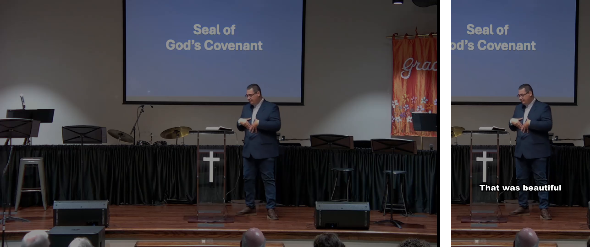

# Sermon Shorts

Turn a full church service recording into vertical, captioned social clips —
like CapCut's "long video to shorts," but built for church services.



*Left: the full service recording. Right: the same moment in the finished
clip — auto-cropped to the speaker, captions burned in.*

Give it the Sunday service MP4 and it will:

1. **Transcribe** the whole service locally with Whisper (word-level timestamps)
2. **Pick the best sermon moments** with Claude — complete, self-contained thoughts
   that work for someone who has never attended your church. It deliberately skips
   worship music (CCLI/music licensing generally does **not** cover social media),
   announcements, and offering segments.
3. **Reframe to 9:16** — tracks the speaker's face through the clip (a bundled
   YuNet detector that still sees a small face in a wide, dim stage shot) and
   crops the vertical frame around them, panning when they walk
4. **Burn in pop-style captions** from the transcript
5. **Render** 1080x1920 MP4s ready for Reels / Shorts / TikTok. Speech is
   leveled in two measured passes — compressed so a peaky room mic doesn't
   sound thin, then brought to −13 LUFS with a true-peak limiter — and each
   cut is settled on the actual gap between words so a clip never ends on
   the first syllable of the next sentence
6. **Design a cover thumbnail** (`<clip>.jpg`) for each clip — a clean,
   caption-free frame centered on the speaker with the headline in bold —
   so the platform doesn't auto-pick an awkward mid-clip frame

Everything runs locally except the highlight-picking step, which sends the
*text transcript only* (never the video) to the Claude API.

## Requirements

- Python 3.10+ (Windows or macOS — no other installs needed; ffmpeg is bundled)
- An Anthropic API key: https://platform.claude.com/

## Setup

```
cd sermon-shorts
python -m venv .venv

# Windows
.venv\Scripts\activate
# Mac
source .venv/bin/activate

pip install -r requirements.txt
```

Set your API key — easiest is a `.env` file in the project folder:

```
# in sermon-shorts/, copy the template and edit it
copy .env.example .env    (Windows)
cp .env.example .env      (Mac)
```

Then put your key in `.env`:

```
ANTHROPIC_API_KEY=sk-ant-...
```

(Setting the `ANTHROPIC_API_KEY` environment variable also works and takes
precedence over the `.env` file.)

## Usage

```
python -m sermon_shorts "C:\videos\sunday-service.mp4" --clips 3
```

### The whole Sunday in one command

If your church is on Subsplash, you can skip the manual download entirely:

```
python -m sermon_shorts --weekly
```

This fetches the newest service recording straight from your church's public
Subsplash media feed (no login or API key needed), trims it to just the
sermon, and cuts clips from the sermon — the full weekly routine in one
command. Add `"subsplash": "yourchurchname"` to `church.json` first — it's
the `<name>` part of your `subsplash.com/u/<name>` media page URL.

The download lands in `~/Downloads` (change with `--download-dir`), and a
recording that's already there is not downloaded again — so re-running is
cheap. `--latest` does just the fetch part, composable with any other mode:

```
python -m sermon_shorts --latest --sermon-only
```

When the Subsplash media item lists a speaker, it's used automatically, so
clip descriptions name whoever actually preached that week — no `--speaker`
needed.

`--weekly` is idempotent: if the newest service's clips already exist it
exits without doing anything (add `--force` to redo), so it's safe to run
on a schedule. `scripts/weekly_cron.sh` is a ready-made scheduled entry
point — it logs to `~/Library/Logs/sermon-shorts.log` and posts a macOS
notification when new clips are ready — meant to be triggered by launchd
(see the example LaunchAgent in the script's comments or point one at the
script on Sunday afternoons).

Output lands in `sunday-service_clips/` next to the video, along with a
`clips.json` manifest (titles, timestamps, and why each moment was chosen) and
a `.txt` file per clip with a ready-to-paste title + description, and a
`.jpg` cover thumbnail per clip to upload as the video's thumbnail.

### Trim a service down to just the sermon

```
python -m sermon_shorts "C:\videos\sunday-service.mp4" --sermon-only
```

Finds where the message starts and ends (skipping worship, announcements,
offering, and the closing) and saves `sunday-service_sermon.mp4` next to the
video — full resolution, no quality loss, done in seconds. The default cut
lands on the nearest keyframe (within a few seconds, absorbed by padding);
add `--reencode` if you need it frame-accurate.

Options:

| Flag | Default | Meaning |
|---|---|---|
| `--clips N` | 3 | how many clips to produce |
| `--out DIR` | `<video>_clips` | output directory |
| `--whisper-model` | `small` | `tiny`/`base`/`small`/`medium`/`large-v3` — bigger is more accurate, slower |
| `--language` | auto | e.g. `en`, `es` |
| `--no-captions` | off | skip burned-in captions |
| `--caption-position` | `auto` | where captions sit: `auto`, `bottom`, `top`, or `center`. `auto` reads the tracked face and keeps captions clear of it — bottom normally, but lifted to the top when the speaker sits low in the frame (e.g. a zoomed-in camera). Force a side to override |
| `--no-thumbnails` | off | skip the designed `.jpg` cover image per clip |
| `--sermon-only` | off | trim the service to just the sermon instead of making clips |
| `--reencode` | off | with `--sermon-only`: frame-accurate cut (slower) |
| `--from-manifest` | off | re-render the exact clips in `clips.json` (no new Claude call) |
| `--only N` | all | with `--from-manifest`: re-render only clip N |
| `--latest` | off | fetch the newest service from your Subsplash feed instead of giving a file |
| `--download-dir DIR` | `~/Downloads` | where `--latest` saves the recording |
| `--weekly` | off | `--latest` + sermon trim + clips, in one run; no-op if already done |
| `--force` | off | with `--weekly`: redo even if this service's clips exist |

### Optional: church profile

Copy `church.example.json` to `church.json` in the project folder and fill in
your details:

```json
{
  "church_name": "Example Community Church",
  "speaker": "Pastor John Smith",
  "footer": "Join us Sundays at 10:00 AM - https://examplechurch.org"
}
```

Clip descriptions will then mention your church and speaker naturally, and
every description ends with your footer line (service times, website — whatever
you want on every post). All fields are optional; without a `church.json` the
descriptions stay generic. Like `.env`, this file stays on your machine and is
never committed.

If your speaker rotates, leave `speaker` out of the config and pass it per
service instead:

```
python -m sermon_shorts sunday.mp4 --speaker "Pastor Mike Jones"
```

## Publishing

Nothing is posted automatically — the weekly run only renders clips. Watch
them, then post the ones you approve by number:

```
python -m sermon_shorts publish "~/Downloads/Kings and Kingdoms_sermon_clips" 1 3
```

Leave the folder off to use the newest `*_clips` folder in `~/Downloads`
(`publish` with no numbers lists its clips). You'll see what's about to go
out and confirm with `y`; clips post **publicly, right away** to YouTube
Shorts, Instagram Reels and Facebook Reels, using the title, description and
cover image already generated. Each post is recorded in the folder's
`published.json`, so running the same command again never double-posts.

| Flag | Meaning |
|---|---|
| `--to youtube instagram facebook` | post only to these (default: every connected platform) |
| `--dry-run` | show what would be posted, post nothing |
| `--yes` | skip the confirmation prompt |
| `--connect youtube` / `--connect meta` | one-time account setup (below) |

### One-time setup: YouTube

1. At https://console.cloud.google.com create a project and enable the
   **YouTube Data API v3**.
2. Set up the OAuth consent screen (External), then **publish the app to
   "In production"** — while it's in "Testing" the login expires every 7 days.
   You'll get an "unverified app" warning when you log in; for a tool only
   you use, click *Advanced → continue*.
3. Create an **OAuth client ID** of type *Desktop app*, download the JSON, and
   save it in the project folder as `youtube_client_secret.json`.
4. Run `python -m sermon_shorts publish --connect youtube` and log in as the
   church channel.
5. **Request YouTube's API audit** (the "YouTube API Services — Audit and
   Quota Extension" form). Google's docs say unaudited projects' uploads are
   locked private; ours have gone up public anyway, but the audit protects
   against that changing. It takes weeks, not minutes, and doesn't block
   posting in the meantime.

The Google login that runs `--connect youtube` may own more than one channel —
pick the church channel in the chooser, and check the first upload landed
there.

The default quota allows about six uploads a day. YouTube's Shorts feed may
still pick its own frame even when the cover image is set.

### One-time setup: Instagram + Facebook

1. The Instagram account must be a **Professional** (Business or Creator)
   account **linked to the church's Facebook Page**.
2. At https://developers.facebook.com create an app (Business type) with
   Facebook Login for Business. No App Review is needed (you're an admin of the
   app), but the app **must be switched to Live**: in development mode its
   Facebook posts are hidden from everyone without a role on the app. Going Live
   needs a privacy policy URL, a data deletion instructions URL, an app icon and
   a category under *App settings → Basic*.
3. Copy the App ID and App Secret (*App settings → Basic*) into `.env` as
   `META_APP_ID` and `META_APP_SECRET`.
4. Under Facebook Login for Business, create a **configuration** (User access
   token; Pages and Instagram assets) with the permissions below — it may first
   ask you to switch `public_profile` to advanced access, which is one click.
   Then in the **Graph API Explorer**, pick your app and that configuration to get a User token with
   `pages_show_list`, `pages_read_engagement`, `pages_manage_posts`,
   `instagram_basic`, `instagram_content_publish` and `business_management`,
   and grant it the church Page and Instagram account.
5. Run `python -m sermon_shorts publish --connect meta` and paste that
   token. It is exchanged for a Page token that doesn't expire and saved to
   `.env`.

Instagram's API only accepts a cover image from a public URL, so Reels get
the first frame as their cover — change it in the Instagram app if you like.
Facebook Reels get the designed cover.

Instagram's API also rejects Reels longer than about 65 seconds (an opaque
`ProcessingFailedError`, regardless of file size). `publish` skips Instagram
for longer clips and says so — post those from the Instagram app.

## Notes

- **First run downloads the Whisper model** (~500 MB for `small`) — after that it
  works offline except for the Claude call.
- **Transcripts are cached** next to the video (`*.transcript-small.json`), so
  re-running with different `--clips` values is fast and only re-asks Claude.
- **Speed:** transcription is the slow step. A 90-minute service takes roughly
  15–45 minutes on a typical laptop CPU with the `small` model. Use `tiny` for a
  quick test pass.
- **Camera assumptions:** built for typical church footage — a static or slow
  camera on the speaker, wide stage shots included. The speaker is picked by
  who is on screen most of the clip, not by who has the biggest face, so
  front-row heads and faces on the slides don't steal the crop. The crop holds
  still while the speaker stays put and pans smoothly when they walk.
  Multi-camera switched feeds work too; fast-moving handheld footage is not
  the target.
- **Audio level:** clips are leveled to −13 LUFS, true peak −1 dB (constants
  at the top of `sermon_shorts/render.py` if your platform wants something
  else). YouTube turns loud uploads down to −14 itself; Reels/TikTok mostly
  play what you give them.
- **Cost:** one Claude call per run, text only — typically a few cents for a
  full-service transcript.
